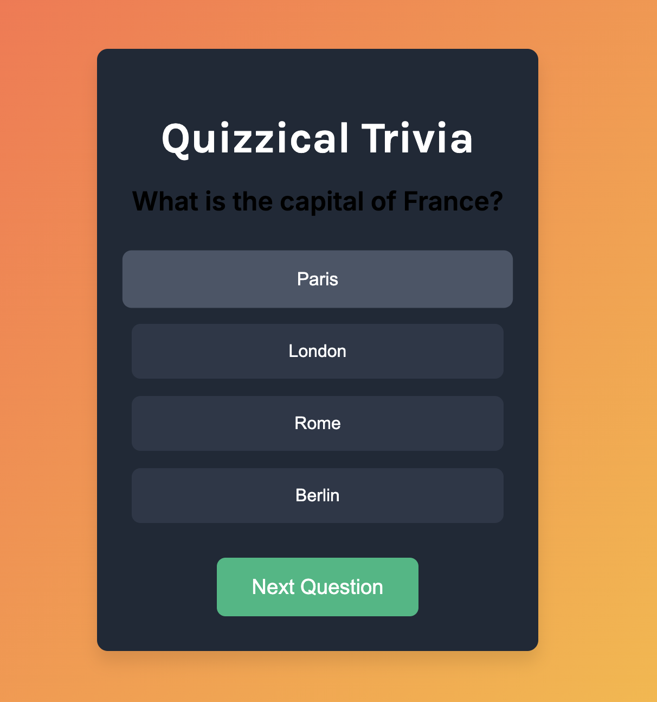
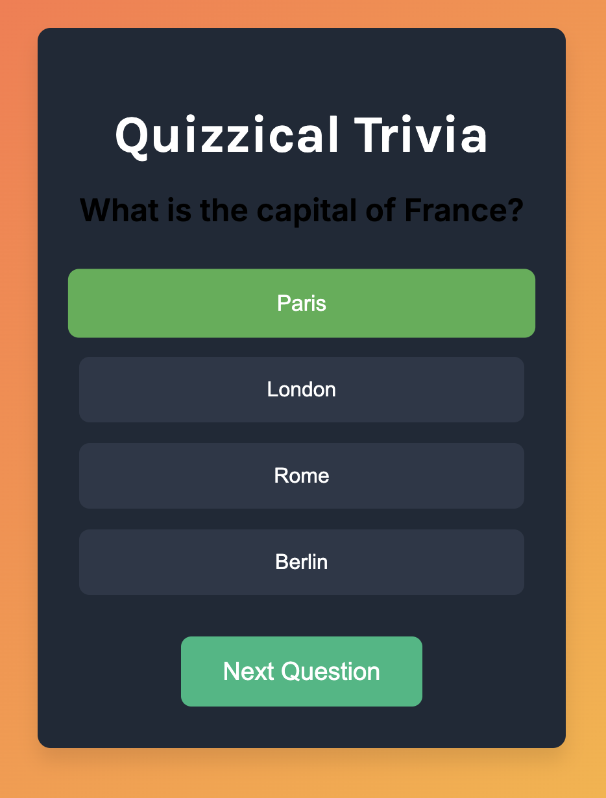

Here's a jazzy and engaging `README.md` file for your Quizzical Trivia app:

---

# 🎉 Quizzical Trivia - The Ultimate Quiz Experience! 🎉

Welcome to **Quizzical Trivia**, the most fun and interactive way to test your knowledge! This app isn't just about answering questions—it's about enjoying the journey with vibrant animations, smooth transitions, and a delightful user experience. Whether you're a quiz master or just here for fun, **Quizzical Trivia** will keep you entertained!


## 🚀 Features

- **✨ Engaging Animations**: Experience a smooth and vibrant UI with fade-ins, hovers, and slides that make every interaction a delight.
- **🧠 Five Challenging Questions**: Test your knowledge with five carefully curated questions across different topics.
- **💯 Instant Feedback**: Get immediate feedback on your answers with color-coded responses.
- **📊 Score Tracking**: See how well you did with a final score display at the end.

## 🎮 How to Play

1. **Go to the pages**
   [link](https://keshri-prasanjeet.github.io/Quizzical-Trivia/)

### OR

1. **Clone the Repo**: Start by cloning the repository to your local machine.
   ```bash
   git clone https://github.com/yourusername/quizzical-trivia.git
   cd quizzical-trivia
   ```
2. **Open the App**: Simply open `index.html` in your favorite browser.
3. **Start Quizzing**: Answer the questions by clicking on the options. Your score will be tallied and displayed at the end.

## 💻 Technologies Used

- **HTML5**: For structuring the content.
- **CSS3**: To bring the app to life with animations and responsive design.
- **JavaScript**: Handles the quiz logic and interactivity.

## 🌈 Screenshots

Here's a sneak peek at what Quizzical Trivia looks like:




## 🤝 Contributing

We love collaboration! If you have suggestions, feature requests, or improvements, feel free to fork the repo and submit a pull request. Let's make **Quizzical Trivia** even better together!

## 📄 License

This project is licensed under the MIT License - see the [LICENSE](LICENSE) file for details.

---

Made with ❤️ by [Prasanjeet Keshri](https://github.com/keshri-prasanjeet)

---

Feel free to replace the placeholders (like `https://github.com/yourusername/quizzical-trivia.git` and `Your Name`) with your actual project details and links!